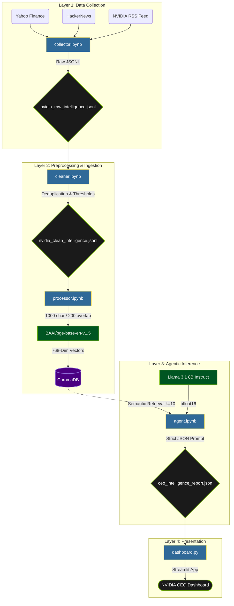
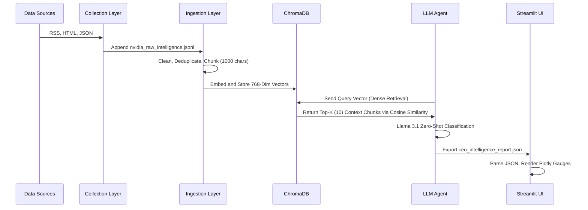

# NVIDIA Strategic Intelligence Agent

An automated, local-first executive advisory system designed to monitor, ingest, and analyze strategic intelligence regarding NVIDIA Corporation. The system leverages Retrieval-Augmented Generation (RAG) and zero-shot LLM classification to generate structured business intelligence dashboards — without relying on external cloud APIs.

---

## System Architecture

This architecture processes multi-source intelligence through a local vector pipeline, ensuring zero corporate data leakage.

---

## Data Flow

The following sequence demonstrates the lifecycle of unstructured web data as it is transformed into a deterministic JSON artifact.

---

## Technology Stack

| Component | Technology |
|---|---|
| Large Language Model | Llama-3.1-8B-Instruct (Meta) |
| Embedding Model | BAAI/bge-base-en-v1.5 |
| Vector Database | ChromaDB |
| Data Processing | Pandas, LangChain Text Splitters |
| Data Ingestion | BeautifulSoup4, Feedparser, yfinance |
| Frontend | Streamlit, Plotly Graph Objects |

---

## Core Design Decisions

**Local-First Architecture**
Cloud-based APIs (OpenAI, Anthropic) were explicitly rejected to adhere to corporate data privacy constraints. All embedding and inference execute locally on an NVIDIA RTX A6000.

**Model Selection — Llama 3.1 8B Instruct**
The 8B parameter model was selected over the 70B variant to avoid destructive 4-bit quantization. Running 8B natively in bfloat16 retains mathematical fidelity for complex financial reasoning while easily fitting within the 48GB VRAM limit. The Instruct variant is strictly required for its tool-calling optimizations, forcing the model to output a parsable JSON schema rather than conversational text.

**Embedding Choice — BAAI/bge-base**
BAAI provides 768-dimensional dense vectors, offering significantly better semantic nuance for financial and semiconductor jargon compared to lighter 384-dimensional models (like MiniLM), without the heavy computational overhead of large-parameter encoders.

**Decoupled Frontend**
The Streamlit dashboard (`dashboard.py`) does not execute LLM inference or database queries. It strictly parses the final `ceo_intelligence_report.json` artifact, ensuring the executive UI remains highly performant and immune to underlying inference latency or VRAM exhaustion.

**Visualization Strategy**
Time-series line graphs were rejected for sentiment analysis because the LLM performs batch zero-shot analysis, yielding a current-state snapshot. Plotting a timeline would require hallucinating historical data. The UI instead uses Plotly gauge charts to accurately represent absolute bounded metrics (0 to 100).

---

## Pipeline Execution

The system operates in four distinct phases:

**Phase 1 — Collection** (`collector.ipynb`)
Ingests raw data from three tiers of intelligence:
- Ground Truth: NVIDIA Official RSS
- Market Reaction: Yahoo Finance
- Developer Sentiment: HackerNews

**Phase 2 — Preprocessing** (`cleaner.ipynb` & `processor.ipynb`)
Deduplicates records, drops low-quality strings, and uses LangChain's `RecursiveCharacterTextSplitter` to chunk documents into 1000-character segments with a 200-character overlap, preventing semantic severing.

**Phase 3 — Ingestion**
Text chunks are passed through the BAAI encoder and loaded into a persistent local ChromaDB instance.

**Phase 4 — Agentic Inference** (`agent.ipynb`)
A dense vector retrieval mechanism uses cosine similarity to extract the top 10 most relevant chunks. These are injected into the Llama 3.1 context window via a strict system prompt, forcing zero-shot sentiment classification and output into a deterministic JSON file.
