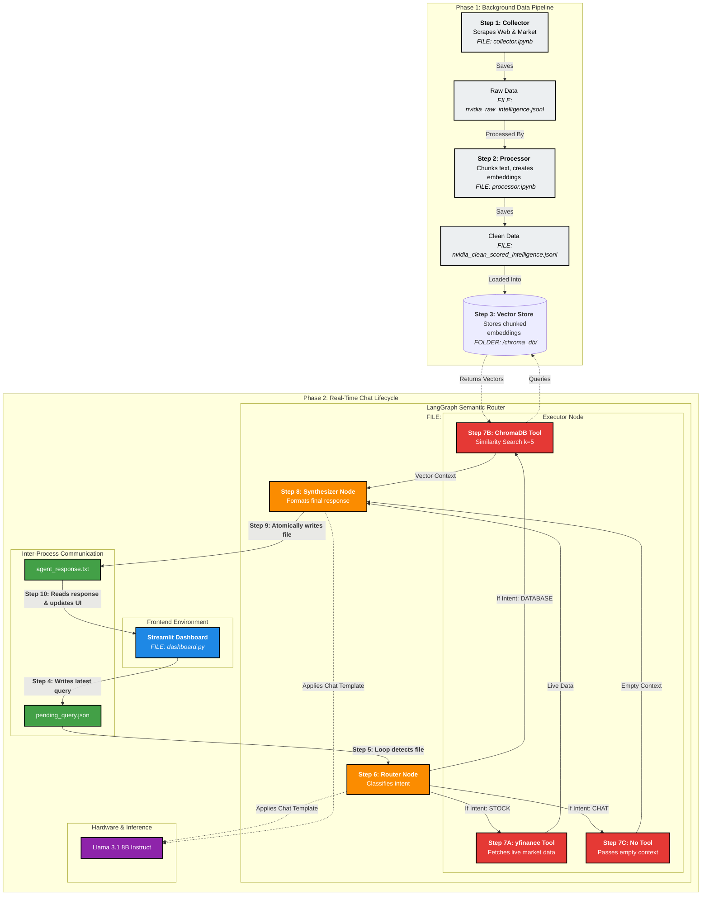

# NVIDIA Executive Intelligence Dashboard & LangGraph Semantic Router

A decoupled, two-phase corporate intelligence platform engineered for real-time executive decision-making. The system utilizes an asynchronous offline data ingestion pipeline to build a clean knowledge base and a deterministic LangGraph State Machine to orchestrate live conversations using a local Llama 3.1 8B Instruct model.

---

## 🛠️ System Architecture

The architecture separates the offline data ingestion lifecycle from the real-time chat execution loop. This decoupling prevents conversational bleed and ensures 100% execution reliability.


## 🗂️ Repository Structure

* **`dashboard.py`**: Streamlit frontend. Renders the executive analytics UI and manages user chat inputs.
* **`worker.py`**: The real-time LangGraph agent process. Handles conversational memory state, runs intent classification, coordinates tools, and runs local LLM inference.
* **`collector.ipynb`**: Handles raw text scraping from targeted business news outlets and APIs.
* **`processor.ipynb`**: Tokenizes raw text, strips analytical overhead, handles text chunking, and writes native semantic embeddings to the vector space.
* **`agent.ipynb`**: Background batch reporter that queries the vector store across 8 distinct vectors to pre-compile static dashboard data (`ceo_intelligence_report.json`).
* **`/chroma_db/`**: Local persistence directory containing indexed vector embeddings.

## 🚀 Core Engine Specifications

### 1. The Async Data Lifecycle
* **Extraction**: Market intelligence data is hoarded in its rawest form by `collector.ipynb`.
* **Refinement**: `processor.ipynb` prepares text payloads for semantic vectorization, filtering out non-contextual artifacts.
* **Storage**: Vector representations are committed to a local Chroma instance using a BAAI dense embedding model.

### 2. LangGraph State Machine & Inter-Process Communication
Smaller open source models (such as Llama 3.1 8B) routinely fail structural ReAct JSON parsing tasks under heavy conversational pressure. This architecture bypasses that limitation entirely:

* **The Inter-Process Communication (IPC) Protocol**: The UI thread (`dashboard.py`) and Inference thread (`worker.py`) communicate strictly through file locks (`pending_query.json` and `agent_response.txt`). This guarantees that UI rendering states remain unblocked during heavy local GPU execution.
* **Node 1 (The Router)**: The LLM functions strictly as a classification engine, mapping user query state and short term context to an exact structural string (`STOCK`, `DATABASE`, or `CHAT`).
* **Node 2 (The Executor)**: Python handles runtime executions deterministically. The LLM is fully walled off from this step. If `DATABASE` is active, it runs an optimized Maximal Marginal Relevance (MMR) search to ensure diverse context window extraction.
* **Node 3 (The Synthesizer)**: Extracted factual payloads are hard-baked into a strict system prompt boundary condition, commanding the model to reject out-of-scope queries while outputting context-grounded prose.

## 📦 Installation & Deployment

### Prerequisites
* CUDA-compatible GPU (Minimum 16 GiB free VRAM allocated for Llama 3.1 8B Instruct inference)
* Python 3.10+
* Local NVIDIA GPU drivers and toolkit configured properly

### Setup Steps

1. **Install dependencies:**
```bash
pip install -r requirements.txt
```
2. **Build the vector database by executing the pipeline notebooks sequentially:**
```bash
# Run notebook runtime for ingestion
jupyter nbconvert --to notebook --execute collector.ipynb
jupyter nbconvert --to notebook --execute processor.ipynb
jupyter nbconvert --to notebook --execute agent.ipynb
```
3. **Initialize the background LangGraph worker process:**
```bash
python worker.py
```

4. **In a separate terminal session, launch the Streamlit dashboard:**
```bash
streamlit run dashboard.py
```
